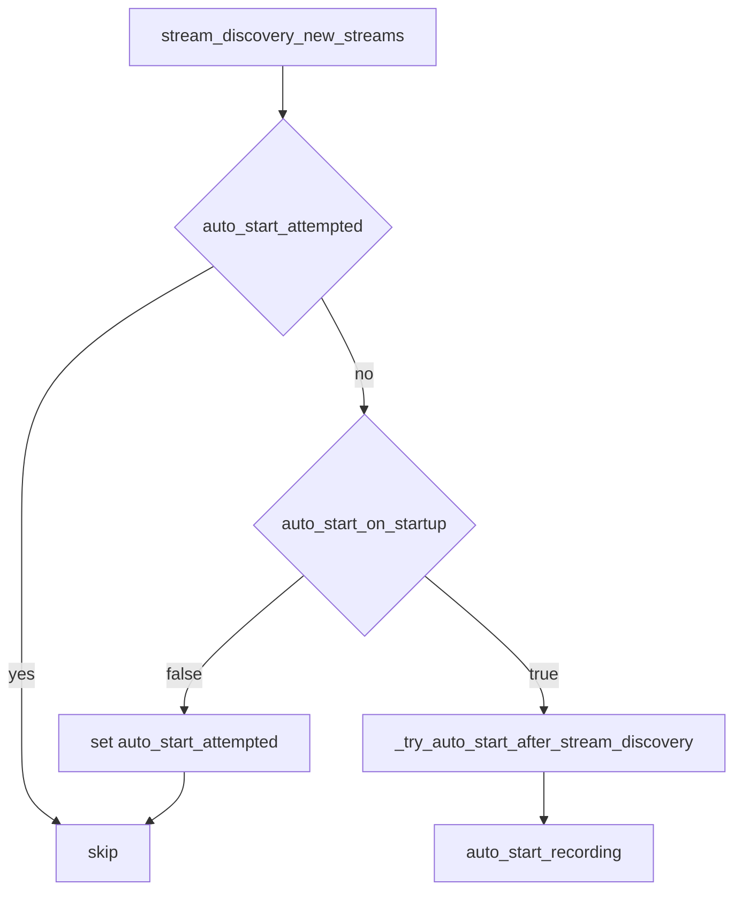

# Auto-start XDF Recording Setting

## Goal

Add a Settings group (same style as Live Log CSV) that controls whether the app auto-starts `.xdf` recording after LSL streams are discovered at startup. **Default remains enabled** so current launch behavior is unchanged unless the user turns it off.

## Current behavior

After stream discovery finds new streams, [`logger_app.py`](src/phologtolabstreaminglayer/logger_app.py) always schedules auto-start:

```2123:2126:src/phologtolabstreaminglayer/logger_app.py
                    if not self.auto_start_attempted and new_streams:
                        # Auto-select own streams and try to start recording
                        self.root.after(500, self._try_auto_start_after_stream_discovery)
```

`_try_auto_start_after_stream_discovery` → `auto_start_recording()` creates a timestamped XDF and starts the recording worker.

## Design decisions (locked)

| Decision | Choice |
|---|---|
| UI | `ttk.LabelFrame` **XDF Recording** on Settings tab, row below Live Log CSV |
| Control | Single checkbox: **Auto-start XDF recording on startup** |
| Default | `True` (preserve today’s always-on auto-start) |
| Persistence | `recording_settings.json` in cwd (`{"auto_start_on_startup": true}`) — same pattern as `live_log_csv_settings.json` |
| Mid-session toggle | Persists immediately; does **not** start/stop an in-progress recording (applies on next launch / next discovery attempt only if `auto_start_attempted` is still false) |
| Gate point | Early return in `_try_auto_start_after_stream_discovery` when disabled; still set `auto_start_attempted = True` so discovery does not keep retrying |



## OpenSpec

Create change `add-auto-start-xdf-setting`:

- `proposal.md` / `tasks.md`
- Delta under `specs/logging/spec.md`: **ADDED** requirement for configurable XDF auto-start (default on; Settings checkbox; persisted)
- Validate: `npx @fission-ai/openspec validate add-auto-start-xdf-setting --strict`

## Implementation

### 1. Settings load/save + init flag

In [`logger_app.py`](src/phologtolabstreaminglayer/logger_app.py):

- Constant `_RECORDING_SETTINGS_FILE = Path("recording_settings.json")`
- Instance flag `self.auto_start_xdf_on_startup: bool` loaded in `__init__` (near live-log CSV init) via `load_recording_settings()`
- `save_recording_settings()` on checkbox toggle

### 2. Gate auto-start

In `_try_auto_start_after_stream_discovery`:

```python
if self.auto_start_attempted:
    return
self.auto_start_attempted = True
if not self.auto_start_xdf_on_startup:
    print("Skipping XDF auto-start: disabled in Settings")
    return
# ... existing select/start logic
```

Discovery may still schedule the callback; the gate inside is the single source of truth.

### 3. Settings UI

Extend Settings tab setup (currently only `setup_live_log_csv_settings_gui` at ~736):

- Call new `setup_recording_settings_gui(settings_tab)` after the live-log group
- LabelFrame at `row=1` with Checkbutton bound to `self.auto_start_xdf_var`
- Toggle handler updates `self.auto_start_xdf_on_startup` and saves JSON

Mirror Live Log CSV widget patterns (`ttk.LabelFrame`, `ttk.Checkbutton`, sticky layout).

## Files to touch

| File | Change |
|---|---|
| `openspec/changes/add-auto-start-xdf-setting/*` | Proposal + logging delta |
| [`src/phologtolabstreaminglayer/logger_app.py`](src/phologtolabstreaminglayer/logger_app.py) | Settings UI, load/save, gate in `_try_auto_start_after_stream_discovery` |

## Verification

1. Fresh launch (no settings file) → checkbox checked; recording still auto-starts after streams appear
2. Uncheck → save → restart → no auto-start; manual Start Recording still works
3. Re-check → restart → auto-start returns
4. Toggling while already recording does not stop the current XDF session
