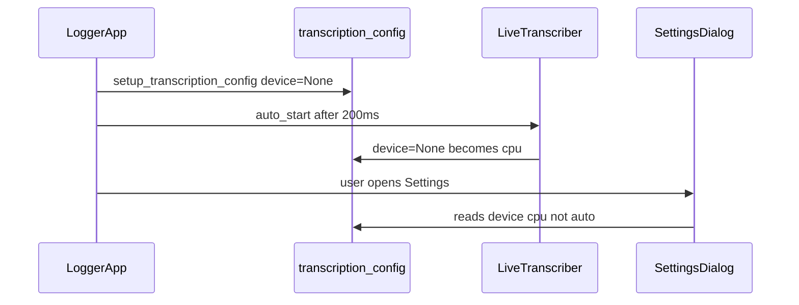

# Default Processing Device to "auto" on every launch

## Root cause

The default is already correct at startup: [`setup_transcription_config()`](C:/Users/pho/repos/EmotivEpoc/ACTIVE_DEV/whisper-timestamped/whisper_timestamped/mixins/live_whisper_transcription.py) sets `device=None`, and the settings dialog maps that to `"auto"`:

```398:398:C:/Users/pho/repos/EmotivEpoc/ACTIVE_DEV/whisper-timestamped/whisper_timestamped/mixins/live_whisper_transcription.py
device_var = tk.StringVar(value=self.transcription_config.device or "auto")
```

The value becomes `"cpu"` before you open Settings because:

1. [PhoLogToLabStreamingLayer `logger_app.py`](C:/Users/pho/repos/EmotivEpoc/ACTIVE_DEV/PhoLogToLabStreamingLayer/src/phologtolabstreaminglayer/logger_app.py) auto-starts transcription 200ms after launch (`self.root.after(200, self.auto_start_live_transcription)`).
2. [`LiveTranscriber.__init__`](C:/Users/pho/repos/EmotivEpoc/ACTIVE_DEV/whisper-timestamped/whisper_timestamped/live.py) **mutates the same `LiveConfig` object** passed from the mixin:

```104:107:C:/Users/pho/repos/EmotivEpoc/ACTIVE_DEV/whisper-timestamped/whisper_timestamped/live.py
if self.cfg.device is None:
    self.cfg.device = "cuda" if TORCH_AVAILABLE and torch.cuda.is_available() else "cpu"
if self.cfg.compute_type is None:
    self.cfg.compute_type = "float16" if self.cfg.device == "cuda" else "int8"
```

On your machine auto resolves to `"cpu"` (no CUDA in PyTorch or no GPU), so `self.transcription_config.device` becomes `"cpu"` and the dropdown shows **cpu** until you pick **auto** and Save.



There is no persisted settings file for this; the in-memory config is overwritten in-process.

## Fix (single behavioral change)

**In [`whisper_timestamped/live.py`](C:/Users/pho/repos/EmotivEpoc/ACTIVE_DEV/whisper-timestamped/whisper_timestamped/live.py)** — resolve device/compute_type into **local variables** (or private attributes like `self._resolved_device`) for `WhisperModel` construction and logging, and **do not assign** to `self.cfg.device` / `self.cfg.compute_type` when the user left them `None` (auto).

Example shape:

```python
resolved_device = cfg.device or ("cuda" if TORCH_AVAILABLE and torch.cuda.is_available() else "cpu")
resolved_compute_type = cfg.compute_type or ("float16" if resolved_device == "cuda" else "int8")
self.model = WhisperModel(..., device=resolved_device, compute_type=resolved_compute_type)
```

Update the CLI log line (~381) to use the resolved values so startup messages stay accurate.

**No change required** in the mixin save/load logic (`"auto"` → `device=None` at line 435) — that is already correct.

## Optional hardening (small, only if you want belt-and-suspenders)

In [`stop_live_transcription()`](C:/Users/pho/repos/EmotivEpoc/ACTIVE_DEV/whisper-timestamped/whisper_timestamped/mixins/live_whisper_transcription.py), reset `device` and `compute_type` to `None` after stop. This is redundant once `live.py` stops mutating the config, but makes behavior obvious if older `live.py` is ever mixed in.

## Out of scope

- A previous plan in [`.cursor/plans/default_transcription_device_auto_c94d6862.plan.md`](C:/Users/pho/repos/EmotivEpoc/ACTIVE_DEV/PhoLogToLabStreamingLayer/.cursor/plans/default_transcription_device_auto_c94d6862.plan.md) concluded "no bug" — that missed the config mutation + auto-start interaction. The hint label under the device dropdown (lines 401–402) is already present; no further UI work needed.
- If you expect **CUDA** at runtime but auto still picks CPU, that is a separate environment issue (`torch.cuda.is_available()` false). This fix only restores the **UI default** and preserves `device=None` as the semantic "auto" preference.

## Verification

1. Launch the logger app (with auto-start transcription enabled).
2. Open **Transcription Settings** without changing anything.
3. **Processing Device** should read **auto** (not cpu/cuda).
4. Save without changes → `transcription_config.device` remains `None`.
5. Stop/start transcription again → Settings still shows **auto**.
