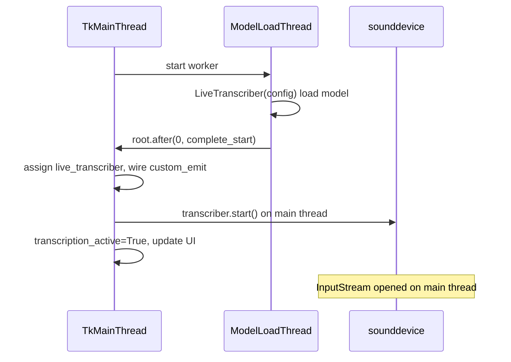

# Fix Transcription Regression After Startup Optimizations

## Diagnosis (matches your symptom)

You see **"Transcribing..."** but **no text** in the log, LSL, or output files. That means:

- Background model load **succeeds** (`LiveTranscriber(...)` completes)
- `_on_ready` runs and UI updates
- **`start()` is invoked**, but **no segments reach `custom_emit`**, or emit updates are lost

The regression is in [`whisper-timestamped/whisper_timestamped/mixins/live_whisper_transcription.py`](../whisper-timestamped/whisper_timestamped/mixins/live_whisper_transcription.py) — specifically `_start_live_transcription_worker`:

```256:289:whisper-timestamped/whisper_timestamped/mixins/live_whisper_transcription.py
    def _start_live_transcription_worker(self, silent: bool, session_name: str, mic_device):
        try:
            LiveTranscriber, _ = _import_live_transcription()
            transcriber = LiveTranscriber(self.transcription_config)
            ...
            transcriber._emit = custom_emit
            transcriber.start()          # <-- runs on background thread (regression)
            ...
            self.root.after(0, _on_ready)
        finally:
            self._transcription_loading = False   # <-- cleared before _on_ready
```

### Root cause 1 — sounddevice started off the main thread (most likely)

Before the startup fix, `LiveTranscriber(...)` **and** `transcriber.start()` ran on the **Tk main thread** ([git HEAD version](whisper-timestamped/whisper_timestamped/mixins/live_whisper_transcription.py)).

Now `start()` opens `sd.InputStream(...)` from a daemon worker thread ([`live.py:312-320`](../whisper-timestamped/whisper_timestamped/live.py)). On Windows, PortAudio/sounddevice mic streams opened from a non-main thread often **appear to start** but deliver **no audio**, so `_transcriber_loop` never emits segments — UI says "Transcribing..." with zero output.

### Root cause 2 — `custom_emit` updates Tk from inference thread

Even when segments are produced, `custom_emit` calls `self.update_log_display(...)` directly from `_transcriber_loop` (background thread). Tkinter is not thread-safe; [`update_log_display`](src/phologtolabstreaminglayer/logger_app.py) catches `TclError` and **silently drops** updates. This was fragile before, but combined with the audio-thread change it makes the failure look total.

### Root cause 3 — state race (secondary)

`finally` clears `_transcription_loading` **before** `_on_ready` sets `live_transcriber` / `transcription_active`. During that window, **Stop does nothing** (`not transcription_active`) while mic may already be open — complicates manual start/stop testing.

## Fix strategy



### 1. Split model load from mic start (primary fix)

In [`live_whisper_transcription.py`](../whisper-timestamped/whisper_timestamped/mixins/live_whisper_transcription.py):

- **Background thread**: only `LiveTranscriber(self.transcription_config)` (slow WhisperModel load)
- **Main thread** (`root.after(0, ...)`): attach `custom_emit`, call `transcriber.start()`, set `self.live_transcriber`, `transcription_active = True`, update UI
- Clear `_transcription_loading` only **after** main-thread start completes (success or failure)

### 2. Thread-safe `custom_emit`

Replace direct GUI/LSL calls with main-thread dispatch:

```python
def custom_emit(segments):
    def _ui_update():
        for seg in segments:
            text = seg.get("text", "").strip()
            if text:
                self.send_lsl_message(text)
                self.update_log_display(f"[TRANSCRIBED] {text}", ...)
    self.root.after(0, _ui_update)
    original_emit(segments)  # jsonl file write stays on inference thread
```

### 3. Robust stop / cancel during load

- Track `self._pending_transcriber` while model loads
- `stop_live_transcription()` should cancel pending load or stop an started-but-not-yet-tracked transcriber
- If load finishes after user cancelled, immediately call `transcriber.stop()` and discard

### 4. Optional: push transcripts to `WhisperLiveLogger` outlet

[`send_lsl_message`](src/phologtolabstreaminglayer/logger_app.py) currently pushes to **TextLogger** only. Add a small mixin helper (e.g. `_send_whisper_lsl_message`) that pushes to `self.outlets.get('WhisperLiveLogger')` when present, and call it from `custom_emit`. This aligns with how [`pho_launch_live_transcription.py`](../whisper-timestamped/whisper_timestamped/pho_launch_live_transcription.py) routes whisper output and ensures LabRecorder captures the whisper stream if selected.

### 5. Verification

After fix, confirm:

1. Start app → status goes Loading → Transcribing quickly; **window stays responsive**
2. Speak into mic → `[TRANSCRIBED] ...` lines appear in log within ~2–15s (step/chunk settings)
3. Files appear under `E:/Dropbox (...)/live_transcripts/<session>.jsonl` and `.wav`
4. Manual Stop works immediately; Start again works without mic-lock errors
5. Optional diagnostic: run with `DEBUG=1` (shows console) and check for sounddevice errors

No changes needed to the startup-timing module or deferred recovery logic — those are working as intended.

## Files to change

| File | Change |
|------|--------|
| [`whisper-timestamped/whisper_timestamped/mixins/live_whisper_transcription.py`](../whisper-timestamped/whisper_timestamped/mixins/live_whisper_transcription.py) | Split load/start; thread-safe emit; fix loading state; optional WhisperLiveLogger push |
| [`whisper-timestamped/whisper_timestamped/live.py`](../whisper-timestamped/whisper_timestamped/live.py) | (Optional) log when `_transcriber_loop` gets zero audio samples after N seconds |

No changes to [`startup_timing.py`](src/phologtolabstreaminglayer/startup_timing.py), [`console.py`](src/phologtolabstreaminglayer/console.py), or [`run_logger.bat`](run_logger.bat) required for this fix.
