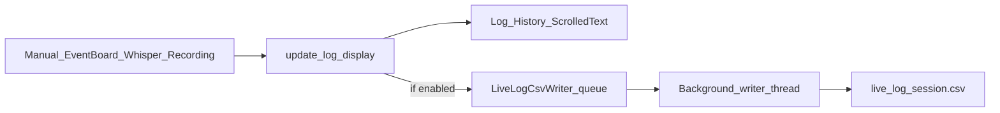

# Live Log History CSV

## Goal

Mirror every line that appears in **Log History** into a plaintext CSV that is:

- **Enabled by default**
- **Appended continuously** (not only on stop/close)
- **Written on a background writer thread** (queue + flush) so the Tk main thread stays responsive
- **Configurable** from the currently empty Settings tab (enable toggle + output directory)

This is separate from the existing post-recording `CSV/*_events.csv` (LSL sample export) and from the Whisper `.jsonl` transcript. Those stay as they are.

## Design decisions (locked)

| Decision | Choice |
|---|---|
| What goes in the CSV | Every `update_log_display(message, timestamp)` line (same content as Log History) |
| Columns | `Timestamp, Message` |
| Default directory | `{xdf_folder}/CSV` under [`get_default_xdf_folder()`](src/phologtolabstreaminglayer/logger_app.py) (same tree as batch events CSV) |
| File naming | One file per app session: `live_log_YYYYMMDD_HHMMSS.csv` |
| Write model | `queue.Queue` + daemon writer thread; open append handle; `flush()` after each row |
| Settings persistence | Small JSON next to EventBoard config: `live_log_csv_settings.json` in cwd (`enabled`, `output_dir`) |
| Disable behavior | Stop enqueueing; writer drains then closes file |



## OpenSpec (Stage 1 first)

Create change `add-live-log-csv` under [`openspec/changes/add-live-log-csv/`](openspec/changes/add-live-log-csv/):

- `proposal.md` — why (human-readable continuous log), what, impact on `logging`
- `tasks.md` — implementation checklist
- `specs/logging/spec.md` — **ADDED** requirement: Live Log History CSV with scenarios for default-on, continuous append, Settings toggle/path, and disable
- Validate with `openspec validate add-live-log-csv --strict`
- **Do not implement until that proposal is approved** (per OpenSpec workflow)

## Implementation

### 1. Background CSV writer module

Add [`src/phologtolabstreaminglayer/features/live_log_csv.py`](src/phologtolabstreaminglayer/features/live_log_csv.py):

- Class `LiveLogCsvWriter` with:
  - `start(output_dir: Path)` — mkdir, open `live_log_{session}.csv`, write header if new, start daemon thread
  - `append(timestamp: str, message: str)` — non-blocking `put_nowait` (drop + warn if queue full; avoid blocking UI)
  - `set_enabled(bool)` / `reconfigure(output_dir)` — for Settings changes mid-session (close old file, open new under new dir if needed)
  - `stop()` — sentinel, join with timeout, close file
- Writer loop: `csv.writer`, one row per item, **`flush()` after each write**
- Normalize multi-line messages (e.g. save-status strings) to a single CSV field via the csv module’s normal quoting

### 2. Hook in Log History choke point

In [`logger_app.py`](src/phologtolabstreaminglayer/logger_app.py) `update_log_display` (~1836):

After building `timestamp` / before or after the ScrolledText insert, call:

```python
if getattr(self, "live_log_csv", None) is not None:
    self.live_log_csv.append(timestamp, message)
```

`LiveLogCsvWriter.append` no-ops when disabled.

Wire lifecycle:

- Construct + `start()` during `__init__` / after `xdf_folder` is known (load settings first)
- `stop()` in existing shutdown path near where transcription/recording are stopped (~2212)

### 3. Settings tab UI

Replace the placeholder at lines 729–730 with a `ttk.LabelFrame` titled **Live Log CSV**:

- Checkbutton: **Enable live log CSV** (default on; bound to settings)
- Entry + **Browse…** for output directory (default `{xdf_folder}/CSV`)
- Optional read-only label showing current session file path
- Apply on toggle/Browse: update writer immediately; persist JSON

Match existing patterns (`ttk.LabelFrame`, nested `ttk.Frame`) used by the Recording tab.

### 4. Settings load/save

- Load `live_log_csv_settings.json` at startup (missing file → `enabled=True`, `output_dir=str(xdf_folder / "CSV")`)
- Save on Apply / Browse / toggle change
- If user changes XDF folder later, do **not** auto-move the live CSV dir unless it still equals the previous default; Settings remains the source of truth for the path

## Files to touch

| File | Change |
|---|---|
| `openspec/changes/add-live-log-csv/*` | New proposal + logging delta |
| `src/phologtolabstreaminglayer/features/live_log_csv.py` | New writer |
| `src/phologtolabstreaminglayer/logger_app.py` | Hook, Settings UI, lifecycle, settings I/O |

## Verification

1. Launch app → Settings shows Live Log CSV enabled; file created under default `…/PhoLogToLabStreamingLayer_logs/CSV/live_log_*.csv` with header
2. Manual log, EventBoard click, and a `[TRANSCRIBED]` line each append a row **while the session is running** (open the CSV in another editor / `Get-Content -Wait`)
3. Disable toggle → further Log History lines do not append; re-enable resumes (same or new file per `reconfigure` policy: keep same session file when only toggling)
4. Change directory via Browse → subsequent rows go to the new folder’s session file
5. Exit app cleanly; CSV closes without truncation; UI never freezes on log spam

## Out of scope

- Replacing Whisper `.jsonl` or adding word-level CSV from `LiveTranscriber._emit`
- Changing batch `save_events_csv` behavior
- Filling the rest of the Settings tab beyond this group
