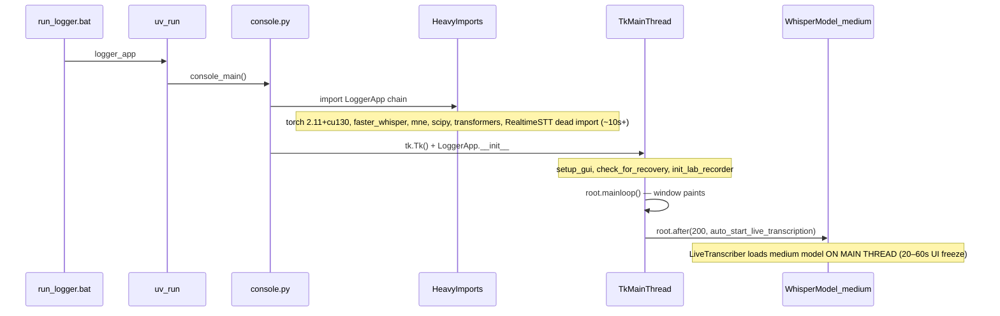

# Startup Hang Root-Cause Analysis

## What `run_logger.bat` actually does

[`run_logger.bat`](run_logger.bat) is minimal:

```bat
uv run logger_app %*
pause
```

That invokes the `logger_app` console script → [`src/phologtolabstreaminglayer/console.py`](src/phologtolabstreaminglayer/console.py) → `LoggerApp` in [`src/phologtolabstreaminglayer/logger_app.py`](src/phologtolabstreaminglayer/logger_app.py).

`uv sync` overhead is **not** the problem (your terminal shows lock resolve in ~3ms). The hang is inside Python startup.

## Startup timeline (matches your “window frozen” symptom)



### Phase A — Heavy imports (before / during early init) — ~10–15s

Evidence from your terminal session (`uv run python logger_app.py`): first pylsl log appears at **10.45s**, meaning most of that time is spent importing before LSL is touched.

Import chain when `LoggerApp` loads:

```5:27:src/phologtolabstreaminglayer/logger_app.py
import pylsl
import pyxdf
...
import mne
...
from whisper_timestamped.mixins.live_whisper_transcription import LiveWhisperTranscriptionAppMixin
from labrecorder import LabRecorder
```

That pulls in [`whisper-timestamped/whisper_timestamped/mixins/live_whisper_transcription.py`](../whisper-timestamped/whisper_timestamped/mixins/live_whisper_transcription.py), which:

- **Imports `RealtimeSTT` at module level but never uses it** (dead import, still pays cost)
- Runs **4× `Path(...).resolve()`** at import time on `E:/Dropbox...` and `L:/ScreenRecordings...`
- Imports `LiveTranscriber` from [`live.py`](../whisper-timestamped/whisper_timestamped/live.py), which imports **`torch`** and **`faster_whisper.WhisperModel`** at import time

Dependency lock shows the stack grew substantially:

| Package | Locked version | Notes |
|---------|----------------|-------|
| `torch` | **2.11.0+cu130** | CUDA build from PyTorch cu130 index; large DLL load |
| `torchaudio` / `torchvision` | 2.11.0+cu130 | Transitive via `whisper-timestamped` |
| `transformers`, `onnxruntime`, `openai-whisper`, `realtimestt` | various | All pulled by editable `whisper-timestamped` |

The April 26 lock refresh ([`14786c1`](14786c1)) aligns with when you noticed regression (~1 month ago). Torch 2.11+cu130 wheels were published **2026-04-27**, i.e. right when the lock changed.

### Phase B — Synchronous init before mainloop — usually seconds, can spike

In `LoggerApp.__init__`:

```115:137:src/phologtolabstreaminglayer/logger_app.py
        self.load_eventboard_config()
        self.setup_gui()
        self.check_for_recovery()
        threading.Thread(target=self.setup_lsl_outlet, daemon=True).start()
        self.root.after(200, self.auto_start_live_transcription)
        ...
        self.init_lab_recorder()
        self.root.after(2000, self.start_stream_discovery)
```

Notable **main-thread** work:

- **`check_for_recovery()`** → `user_select_xdf_folder_if_needed()` → `.exists()`, `.is_dir()`, and `glob('*.backup.json')` on `E:\Dropbox (Personal)\...` ([`logger_app.py:1130-1153`](src/phologtolabstreaminglayer/logger_app.py)). Slow when Dropbox is syncing or the drive is latent.
- **`init_lab_recorder()`** is fast (reads a local state file; no network timeout).

LSL outlet setup was already moved to a background thread (Dec 2025 commit `ffae06c`), so that is **not** the regression.

### Phase C — Primary cause of “window visible but frozen” — Whisper model on main thread

200ms after the window appears:

```128:128:src/phologtolabstreaminglayer/logger_app.py
        self.root.after(200, self.auto_start_live_transcription)
```

`auto_start_live_transcription()` → `start_live_transcription(silent=True)` → creates `LiveTranscriber`, which **synchronously** constructs:

```107:111:whisper-timestamped/whisper_timestamped/live.py
        self.model = WhisperModel(
            self.cfg.model,
            device=self._resolved_device,
            compute_type=self._resolved_compute_type,
        )
```

Default model is **`medium`** ([`live_whisper_transcription.py:196-198`](../whisper-timestamped/whisper_timestamped/mixins/live_whisper_transcription.py)). Loading `medium` via faster-whisper on the **Tk main thread** freezes all UI input for **20–60+ seconds** (CPU) or still noticeable time even with CUDA while weights initialize.

Your terminal confirms this path runs immediately after startup:

```
INFO:whisper_timestamped.mixins.live_whisper_transcription:.start_live_transcription()  hit
```

This exactly matches your selected symptom: **window appears, then hangs**.

## Secondary issue: broken `uv run logger_app` entry point (intermittent failure)

Committed [`pyproject.toml`](pyproject.toml) had:

```toml
logger_app = "logger_app:console_main"   # broken — no installed top-level `logger_app` module
```

Your local uncommitted fix (correct):

```toml
logger_app = "phologtolabstreaminglayer.console:console_main"
```

Terminal error when the old script was still installed:

```
ModuleNotFoundError: No module named 'logger_app'
```

Workaround that does start (but still slow): `uv run python logger_app.py`. After fixing entry point, run `uv sync` once to regenerate `.venv\Scripts\logger_app.exe`.

## What is NOT causing the hang

- **`pause` in `run_logger.bat`** — runs only after the app exits
- **`auto_hide_console()`** — intentionally prevents stdout-related deadlocks; not a startup delay
- **`uv run` lock/sync** — resolves in milliseconds in your logs
- **Singleton lock check** — local file/msvcrt; negligible
- **Stream discovery** — deferred 2s and runs in a background thread

## Recommended fix strategy (ordered by impact)

### 1. Stop blocking the Tk main thread for Whisper (highest impact for your symptom)

Move model creation/start to a daemon thread; update UI labels via `root.after(0, ...)`:

- In [`live_whisper_transcription.py`](../whisper-timestamped/whisper_timestamped/mixins/live_whisper_transcription.py): wrap `LiveTranscriber(...)` + `.start()` in `threading.Thread`
- Show status like “Loading transcription model…” immediately; enable controls when ready
- Optionally **disable auto-start by default** or default to `small`/`base` for faster first load

### 2. Trim import-time cost (reduces pre-window delay)

- **Remove unused** `from RealtimeSTT import AudioToTextRecorder` in `live_whisper_transcription.py`
- **Lazy-import** transcription stack: only import `LiveWhisperTranscriptionAppMixin` / `live.py` when the Live Audio tab is opened or when user clicks Start (not at `logger_app` import time)
- **Defer** module-level `Path(...).resolve()` on Dropbox/L: paths until first use
- Consider splitting `whisper-timestamped` runtime deps: use a `[live]` optional extra instead of pulling `transformers`, `ipykernel`, `openai-whisper`, `realtimestt` into every app launch

### 3. Defer Dropbox I/O until after UI is responsive

- Move `check_for_recovery()` to `root.after(0, ...)` or a short delayed callback so the window can accept input first
- Replace eager `_default_xdf_folder = Path(...).resolve()` at import with lazy resolution inside `user_select_xdf_folder_if_needed()`

### 4. Dependency / torch tuning (environment-level)

- If CUDA is not required on this machine, pin **CPU torch** or a smaller CUDA variant to cut import time and DLL loading
- Audit whether full `whisper-timestamped` stack is needed for logging-only sessions

### 5. Fix launcher reliability

- Commit the corrected entry point in [`pyproject.toml`](pyproject.toml)
- Optionally change [`run_logger.bat`](run_logger.bat) to call `.venv\Scripts\python.exe logger_app.py` directly (avoids console-script wrapper issues after edits)

## Verification plan (before/after)

Add temporary timing prints (or a small `scripts/profile_startup.py`) at:

1. Start of `console_main`
2. After `import LoggerApp`
3. After `LoggerApp.__init__` returns
4. When `mainloop` begins processing events
5. Before/after `WhisperModel(...)` construction

Expected outcome after fixes:

| Phase | Current (est.) | Target |
|-------|----------------|--------|
| Imports | 10–15s | 3–8s with lazy imports |
| Window responsive | frozen 20–60s | responsive immediately |
| Transcription ready | blocks UI | background load; UI shows progress |

Also test with Dropbox paused vs active to quantify Phase B contribution.

## Files to change (implementation pass)

- [`src/phologtolabstreaminglayer/logger_app.py`](src/phologtolabstreaminglayer/logger_app.py) — defer recovery check; optional lazy mixin import
- [`../whisper-timestamped/whisper_timestamped/mixins/live_whisper_transcription.py`](../whisper-timestamped/whisper_timestamped/mixins/live_whisper_transcription.py) — remove RealtimeSTT import; background model load; lazy path resolve
- [`../whisper-timestamped/whisper_timestamped/live.py`](../whisper-timestamped/whisper_timestamped/live.py) — optional lazy torch import (already partially guarded)
- [`pyproject.toml`](pyproject.toml) — fix entry point (local change ready); optional torch/extras split
- [`run_logger.bat`](run_logger.bat) — optional direct python invocation
