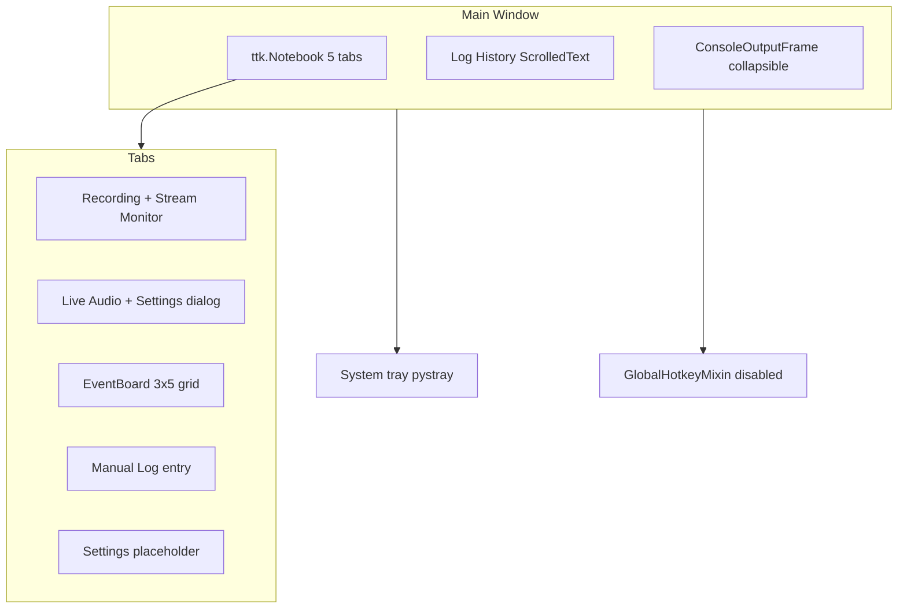

# UI Implementation Review and Fix Plan

## Review verdict

The production UI in [`src/phologtolabstreaminglayer/logger_app.py`](src/phologtolabstreaminglayer/logger_app.py) is **substantially complete and usable**. All primary workflows are wired: notebook tabs, LSL outlets/inlets, XDF recording (LabRecorder in-process, new LabRecorderService RCS path, legacy fallback), EventBoard grid, manual/quick logging, collapsible console capture, system tray, and live transcription (via external mixin).

Per your choices: **Settings tab stays a deferred placeholder**; **window X quits the app** (document this, do not revert to minimize-on-close).



---

## What is complete and functional

| Area | Status | Notes |
|------|--------|-------|
| Recording tab | Working | Start/Stop/Split, status labels, taskbar flash, stream monitor with select/deselect |
| Live Audio tab | Working | Start/Stop, device combobox, Settings dialog in [`whisper-timestamped/.../live_whisper_transcription.py`](C:/Users/pho/repos/EmotivEpoc/ACTIVE_DEV/whisper-timestamped/whisper_timestamped/mixins/live_whisper_transcription.py) |
| Processing device "auto" UI | Fixed | [`live.py`](C:/Users/pho/repos/EmotivEpoc/ACTIVE_DEV/whisper-timestamped/whisper_timestamped/live.py) resolves device into `_resolved_device` without mutating `cfg.device` |
| EventBoard tab | Working | Loads [`eventboard_config.json`](eventboard_config.json), toggle/instantaneous events, time offsets |
| Manual Log + Log History | Working | Enter-to-log, keystroke timestamps, clear button |
| Console panel | Working | Toggle bar at bottom, stdout/stderr capture, cleanup in `on_closing()` |
| System tray | Working | Show App, Quick Log popover, Exit; custom click handlers in `LoggerApp.setup_system_tray()` |
| LabRecorderService RCS | Implemented (uncommitted) | New `service_rcs_recording_worker()` path in current diff |

---

## Gaps and bugs to fix (prioritized)

### P1 — Functional bugs

**1. Split Recording broken in LabRecorderService mode**

[`start_new_split_recording()`](src/phologtolabstreaminglayer/logger_app.py) gates on `has_any_inlets` only:

```1527:1531:src/phologtolabstreaminglayer/logger_app.py
    def start_new_split_recording(self):
        """Start new recording after split"""
        if not self.has_any_inlets:
            print("Cannot split recording: no inlet available")
            return
```

When the RCS service path is active, recording does not require legacy inlets (same as [`start_recording()`](src/phologtolabstreaminglayer/logger_app.py) which already allows LabRecorder without inlets). **Fix:** mirror `start_recording`'s guard — allow split when `is_lab_recorder_available()` OR `has_any_inlets`.

**2. Auto-start transcription can pop error dialogs on launch**

At 200ms after startup, `auto_start_live_transcription()` calls `start_live_transcription()`, which shows `messagebox.showerror` on failure and the auto-start wrapper **re-raises**:

```352:358:C:/Users/pho/repos/EmotivEpoc/ACTIVE_DEV/whisper-timestamped/whisper_timestamped/mixins/live_whisper_transcription.py
    def auto_start_live_transcription(self):
        try:
            self.start_live_transcription()
        except Exception as e:
            print(f'auto_start_live_transcription(): encountered error {e}.')
            raise
```

**Fix (minimal):** In the mixin, add an optional `silent: bool = False` param to `start_live_transcription()` to skip the messagebox when auto-starting; make `auto_start_live_transcription()` log-only (never re-raise). Manual Start button keeps the dialog.

**3. LSL outlet setup aborts on first failure**

In [`setup_lsl_outlet()`](src/phologtolabstreaminglayer/logger_app.py), a failure in any of the three outlets (TextLogger, EventBoard, WhisperLiveLogger) `raise`s and prevents remaining outlets from being created. **Fix:** catch per-outlet, log error, continue loop; only mark overall failure if zero outlets succeed.

**4. LabRecorderService not cleaned up on shutdown**

[`cleanup_lab_recorder()`](src/phologtolabstreaminglayer/logger_app.py) only handles in-process `self.lab_recorder`, not `self.lab_recorder_service_client`. **Fix:** if service client exists and recording is active, call `_service_rcs_stop_recording()` before exit.

### P2 — UX / docs mismatches (no Settings tab work)

**5. README vs actual behavior** ([`README.md`](README.md))

Update to match current code:
- **Close (X):** quits completely via `on_closing()` in [`logger_app.py`](logger_app.py); minimize via **Minimize to Tray** button only
- **Global hotkey:** `should_register_global_hotkey = False` in [`global_hotkey.py`](src/phologtolabstreaminglayer/features/global_hotkey.py) — hotkey is **off by default**; Quick Log still works from tray menu
- **Icons:** repo only has [`icons/LogToLabStreamingLayerIcon.svg`](icons/LogToLabStreamingLayerIcon.svg); app falls back to drawn "L" icon when PNG/ICO missing

**6. Stream monitor column layout (cosmetic)**

Treeview defines a `Name` column but inserts name into tree column `#0`, leaving the `Name` data column blank:

```775:776:src/phologtolabstreaminglayer/logger_app.py
        columns = ('Select', 'Name', 'Type', 'Channels', 'Rate', 'Status')
```

**Fix:** remove `'Name'` from `columns` tuple and re-align headings/widths (one-line UI polish).

### P3 — Deferred / out of scope (per your direction)

- **Settings tab placeholder** — intentionally deferred; transcription settings remain in Live Audio → Settings dialog
- **App-wide settings persistence** — not required now
- **Enable global hotkey by default** — defer unless you later add a Settings toggle
- **Generate PNG/ICO from SVG** — optional asset task; fallback icon works

---

## Verification checklist (manual)

After fixes, verify on your machine:

1. **Launch** — app opens on Recording tab; console toggle expands/collapses; no error dialog if transcription auto-start fails (e.g., temporarily rename whisper model path)
2. **Recording** — Start/Stop updates labels and taskbar flash; with LabRecorderService running, recording starts via RCS; Split produces a new XDF file
3. **Stream monitor** — Refresh, Select All/None, click-to-toggle; columns align (no empty Name column)
4. **Live Audio** — Settings shows **auto** for Processing Device after auto-start; Save preserves `device=None`
5. **EventBoard** — instantaneous + toggle buttons log to history and LSL
6. **Tray** — Quick Log popover works; Exit cleanly stops recording/transcription and restores stdout/stderr
7. **Close X** — full quit (not minimize)
8. **README** — documents quit-on-close and disabled hotkey

---

## Files to touch

| File | Change |
|------|--------|
| [`src/phologtolabstreaminglayer/logger_app.py`](src/phologtolabstreaminglayer/logger_app.py) | Split guard, outlet setup resilience, service cleanup, stream tree columns |
| [`whisper-timestamped/.../live_whisper_transcription.py`](C:/Users/pho/repos/EmotivEpoc/ACTIVE_DEV/whisper-timestamped/whisper_timestamped/mixins/live_whisper_transcription.py) | Silent auto-start transcription |
| [`README.md`](README.md) | Close behavior, hotkey default, icon fallback note |

No changes to the Settings tab placeholder.
